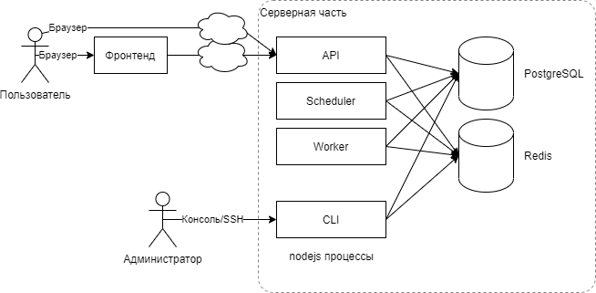
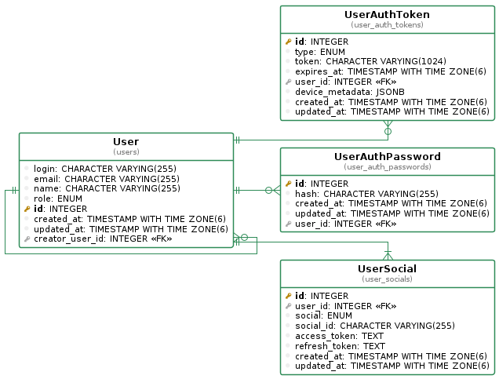

## Описание

Шаблонный проект для создания серверного приложения на основе фреймворка NestJS на языке TypeScript.

Включает в себя использование следующих инструментов и технологий:

* PostgreSQL
* Redis
* Docker
* NestJS
* NestJS CLI plugins
* NestJS Schedule
* GraphQL
* [graphql-faker](https://github.com/Proscom/graphql-faker/tree/overrides)
* TypeORM
* typeorm-uml
* bull
* ESLint
* Prettier

В будущем они будут описаны тут более подробно


## Документация

* [Как создать проект на основе этого шаблона?](./docs/fork.md)
* [Гайд по стилю разработки](./docs/code.md)
  
### Инструменты разработки

* [GraphQL Faker](docs/faker.md)

## Архитектура проекта



_(При разработке проекта поддерживайте данную схему в актуальном состоянии с помощью draw.io)_

Данный проект использует базовую шаблонную архитектуру проектов Proscom.

Предполагается, что взаимодействие пользователя с бекендом осуществляется преимущественно через SPA-фронтенд (или мобильное приложение). В таком случае роль бекенда - предоставление REST и GraphQL API для потребления фронтендом.

### Процессы

Бекенд состоит из нескольких процессов / точек входа, представленных в папках соответствующих модулей: 

- `api/api.ts` (API) - основная точка входа. Создаёт http сервер, биндится на заданный порт и отвечает на входящие http запросы. Предполагается, что `api.ts` запускается в виде демона через менеджер процессов (pm2 или docker) и постоянно поддерживается в запущенном состоянии. 

- `scheduler/scheduler.ts` (Scheduler) - обработчик расписания. Запускается в виде демона через менеджер процессов и выполняет задачи приложения по расписанию (по поведению похоже на `cron`). Задания определяются в файлах `.schedules.ts`.

- `worker/worker.ts` (Worker) - основной обработчик заданий. Запускается в виде демона через менеджер процессов и выполняет по очереди задания из всех доступных очередей. При развитии приложения может потребоваться создание дополнительных вариантов воркеров для разделения очередей.

- `cli/cli.ts` (CLI) - точка входа для консольных команд, выполняемых вручную администратором. Команды определяются в файлах `.command.ts`.

Дополнительная точка входа `cli/plantuml.ts` предназначена для построения диаграммы сущностей. Аналогично `cli.ts` она вызывается вручную администратором в консоли.

Запускать точки входа рекомендуется не на прямую, а с помощью скриптов из `package.json`.

Таким образом, из одной кодовой базы запускается несколько процессов, выполняющих различные задачи. 

По умолчанию данный шаблон также поддерживает горизонтальное масштабирование, а именно запуск нескольких инстансов API и Worker на разных серверах для увеличения суммарной мощности (при условии подключения к одним и тем же базам PostgreSQL и Redis). При разработке конкретного приложения на основе шаблона желательно поддерживать возможность горизонтального масштабирования, но не обязательно.

### Диаграмма сущностей



Для построения диаграммы на основе определений сущностей TypeORM, выполните команду:
```bash
yarn run build:diagram
```

Для запуска этой команды необходимо запустить docker-контейнер `plantuml-server`.
Для этого используйте профиль `dev` для `docker-compose`: 
```bash
docker compose --profile dev up -d
```
